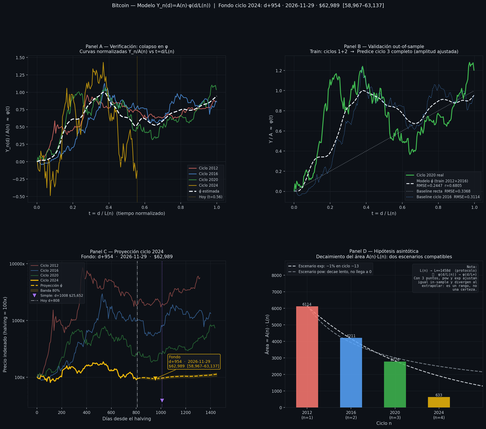

# Bitcoin Halving Cycle Research

> Investigación exploratoria sobre la estructura temporal de los ciclos de halving de Bitcoin: ¿existe una **forma de ciclo universal** φ(t) una vez que cada ciclo se reescala por su duración L(n) y su amplitud A(n)?

**[English version →](README.md)**



## El modelo

Cada ciclo de halving `n` (1 = 2012, 2 = 2016, 3 = 2020, 4 = 2024) se trata como una instancia de la misma curva subyacente:

```
Y_n(d) = A(n) · φ(d / L(n)) + ε
```

| Término | Significado | Comportamiento |
|---|---|---|
| `Y_n(d)` | log del precio indexado al día del halving (`halving = 100x`) | observado |
| `L(n)` | duración del ciclo en días | crece con n, converge al límite del protocolo L∞ = 210,000 bloques × 10 min ≈ 1,458 días |
| `A(n)` | amplitud del ciclo en log-espacio | decae con n |
| `φ(t)` | forma universal normalizada en t ∈ [0,1], φ(0)=0, max φ = 1 | compartida por todos los ciclos |

Si L(n) y A(n) se modelan correctamente, las cuatro curvas normalizadas deberían colapsar en una sola forma (Panel A de la figura). La censura se resuelve dentro del modelo: el ciclo 2024 en curso está truncado a la derecha, y su amplitud se estima a partir de la porción observada en lugar del máximo parcial (sesgado).

## Metodología

- **Datos** — API community de CoinMetrics (2012–2014) empalmada con Yahoo Finance (2014–hoy), cierres semanales.
- **Forma φ** — las curvas normalizadas se promedian por bins sobre una grilla temporal común (80 bins en t, primero dentro de cada ciclo y después entre ciclos), y se ajusta una spline cúbica suavizada cuya penalización λ se elige por Validación Cruzada Generalizada (`scipy.interpolate.make_smoothing_spline`).
- **Amplitudes A(n)** — mínimos cuadrados alternados: dado φ, cada A(n) es una regresión sin intercepto `A = Σφ·Y / Σφ²`; dadas las A(n), se reajusta φ. Esto resuelve naturalmente la censura del ciclo 2024.
- **Incertidumbre** — bootstrap circular por bloques de los residuos (bloques de 8 semanas), con refit completo del modelo en cada réplica (N = 1,000). La banda del 80% es condicional a que el modelo sea correcto.
- **Decaimiento de la amplitud** — los ajustes power-law y exponencial de A(n)·L(n) se reportan como *escenarios separados*: con solo 3 ciclos completos son indistinguibles in-sample y divergen al extrapolar.

## Validación out-of-sample

El modelo se entrena con los ciclos 2012 + 2016 y predice el **ciclo 2020 completo**. La amplitud se ajusta por regresión para cada candidato, de modo que la comparación aísla la calidad de la *forma* — que es lo que el modelo aporta:

| Forma candidata | RMSE | MAE | R² | r |
|---|---|---|---|---|
| **Modelo φ̂** | **0.2447** | 0.1829 | 0.4208 | 0.6805 |
| Recta φ(t) = t | 0.3368 | — | — | — |
| Ciclo 2016 reescalado | 0.3114 | — | — | — |

## Hallazgos empíricos principales (a julio 2026, día d+808 del ciclo 2024)

- Los ciclos 2012–2020 colapsan razonablemente bien en una sola forma normalizada.
- Amplitudes estimadas: **A(n) = 4.64, 3.00, 1.93, 0.44**. El patrón de decaimiento histórico (ajustes power-law / exponencial sobre los tres primeros ciclos) predecía A(4) ≈ 1.25–1.69; los datos observados dan **0.44** — el ciclo 2024 es mucho más débil de lo que el patrón implicaba, lo que tensiona la hipótesis de universalidad que el modelo fue diseñado para testear.
- Bajo el escenario exponencial, el "área" del ciclo A(n)·L(n) cae por debajo del 1% de su valor inicial alrededor del ciclo ~13; bajo el escenario power-law decae lento y nunca llega a cero. Los datos no permiten distinguir entre ambos.

## Cómo correrlo

```bash
pip install -r requirements.txt
python modelo_avanzado.py
```

El script descarga los datos, ajusta el modelo, imprime un reporte completo en consola y guarda la figura de cuatro paneles en `figures/`. `base.py` contiene el baseline simple por promedio histórico contra el que se compara el modelo.

## Limitaciones

- Solo existen **3 ciclos de halving completos** (más uno parcial). El tamaño muestral es extremadamente pequeño y toda extrapolación debe leerse en consecuencia.
- Los halvings pueden no ser la fuerza causal de los ciclos observados — los ciclos de liquidez macro, las olas de adopción y la reflexividad son confusores plausibles.
- Los parámetros L(n), A(n) podrían no ser estables en ciclos futuros; el ciclo 2024 ya se desvía fuertemente del patrón histórico de amplitud.
- La banda del bootstrap es condicional a la especificación del modelo y subestima la incertidumbre total.
- El modelo debe considerarse **exploratorio**, no predictivo.

## Disclaimer

Este proyecto es una investigación exploratoria sobre la estructura temporal de los ciclos de halving de Bitcoin. **No** pretende predecir precios futuros y **no** constituye asesoría financiera.

Parte de la formulación matemática y del proceso de modelado fue desarrollada iterativamente con asistencia de modelos de inteligencia artificial (Claude, de Anthropic). El autor comprende la lógica conceptual, las hipótesis y los procedimientos de validación implementados, mientras que algunas formulaciones estadísticas avanzadas continúan en estudio y refinamiento. Las notas de diseño usadas durante ese proceso asistido por IA se conservan en [`CLAUDE.md`](CLAUDE.md) por transparencia.

## Licencia

[MIT](LICENSE)
